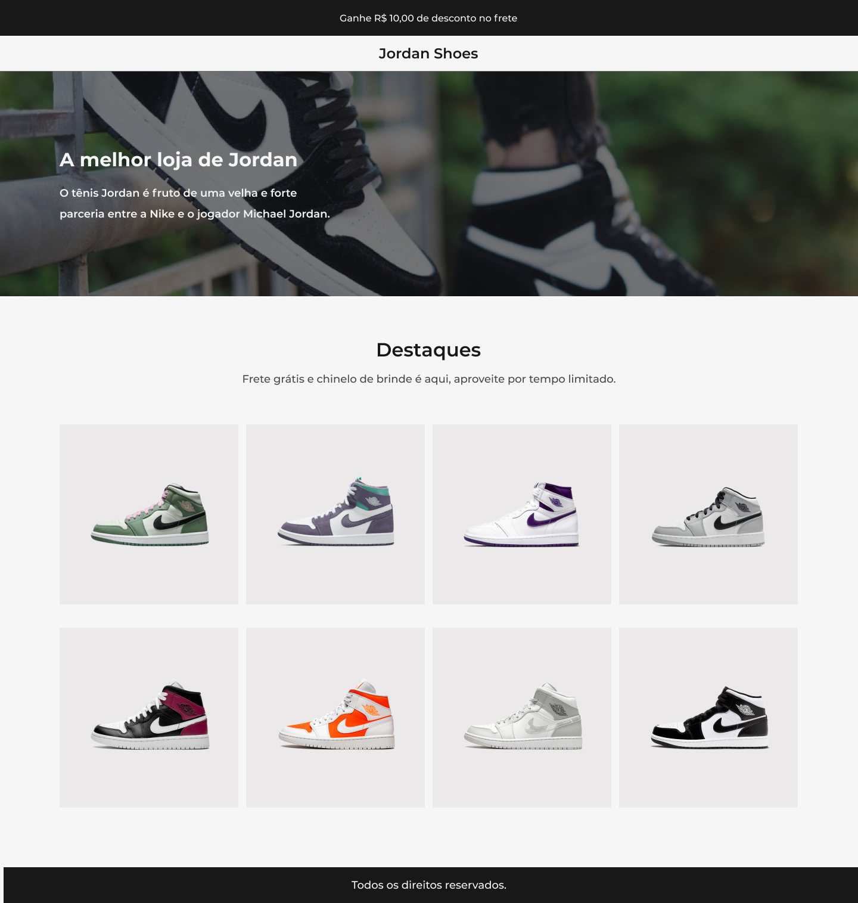

# Desafio 2 - JordanShoes  [Codelândia IuriCode]  💻

## 📌 Sobre

### 🥇 Segundo projeto dos desafios da Codelândia propostos por  <a href="https://www.linkedin.com/in/iuricode/">IuriCode</a>.

## 🎯 Layout do Projecto

 

## 💻 Tecnologias utilizadas

### ✅ HTML 
### ✅ CSS
### ✅ JavaScript

## 🎉 Resultado

### 🧐 Acesse o resultado clicando <a href="https://desafio-02-codelandia.vercel.app/" target="_blank">aqui</a>